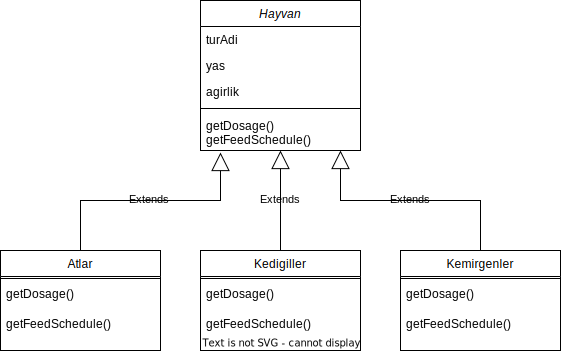
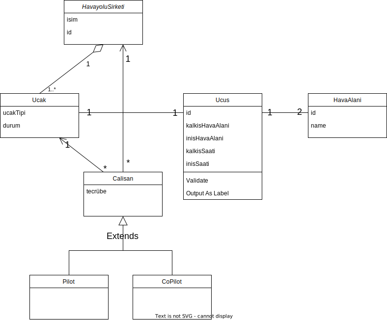

# [Patika](https://patika.dev) Nesne Yönelimli Programlama Dersi Ödevleri

### İçindekiler
* [Üniversite Yönetim Sistemi](#üniversite-yönetim-sistemi)
* [Hayvanat Bahçesi Yönetimi](#hayvanat-bahçesi-yönetimi)
* [Uçuş Yönetim Sistemi](#uçuş-yönetim-sistemi)

---

## Üniversite Yönetim Sistemi

1. Üniversiteye ait sınıflıklar, çalışma ofisleri ve departmanlar vardır.
2. Departmanlara ait ofisler vardır.
3. Üniversiteye ait çalışanlar vardır. Bu çalışanlar profesör veya memur olabilir.
4. Her çalışan bir ofiste çalışır.

---

## Hayvanat Bahçesi Yönetimi
* Hayvanlar:
  * Atlar (atlar, zebralar, eşekler vb.),
  * Kedigiller (kaplanlar, aslanlar vb.),
  * Kemirgenler (sıçanlar, kunduzlar vb.) gibi gruplardaki türlerle karakterize edilir.
  * Hayvanlar hakkında depolanan bilgilerin çoğu tüm gruplamalar için aynıdır.
  * tür adı, ağırlığı, yaşı vb.
  * Sistem ayrıca her hayvan için belirli ilaçların dozajını alabilmeli => getDosage ()
  * Sistem Yem verme zamanlarını hesaplayabilmelidir => getFeedSchedule ()
  

---

## Uçuş Yönetim Sistemi

* Hava yolu şirketleri uçuşları gerçekleştirir. Her hava yolunun bir kimliği vardır.
* Hava yolu şirketi, farklı tipteki uçaklara sahiptir.
* Uçaklar çalışır veya onarım durumunda olabilir.
* Her uçuşun benzersiz kimliği, kalkacağı ve ineceği havaalanı, kalkış ve iniş saatleri vardır.
* Her uçuşun bir pilotu ve yardımcı pilotu vardır ve uçağı kullanırlar.
* Havaalanlarının benzersiz kimlikleri ve isimleri vardır.
* Hava yolu şirketlerinin pilotları vardır ve her pilotun bir deneyim seviyesi mevcuttur.
* Bir uçak tipi, belirli sayıda pilota ihtiyaç duyabilir.

---

